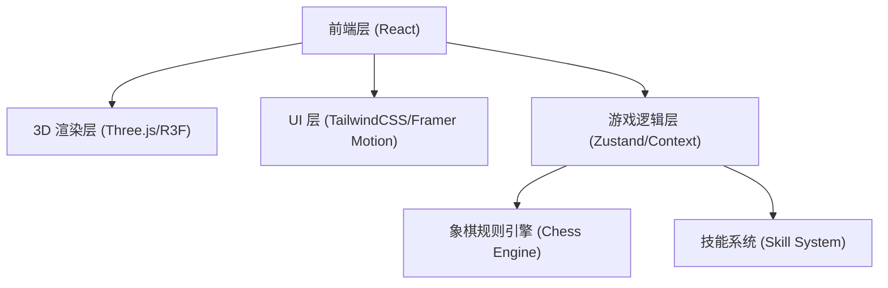

## 1. 架构设计


## 2. 技术说明
- 前端框架: React@18 + Vite
- 3D 渲染: three, @react-three/fiber, @react-three/drei, @react-three/postprocessing
- 样式与动画: tailwindcss@3, framer-motion (处理 UI 动画与页面过渡)
- 状态管理: zustand (管理棋局状态、能量值、当前回合等)
- 逻辑处理: 自定义象棋走法规则与技能特效钩子
- 初始化工具: vite-init

## 3. 路由定义
本 Demo 作为一个单页面应用，不需要复杂的路由跳转。
| 路由 | 目的 |
|------|------|
| / | 对战主界面，包含 3D 棋盘和 UI 覆盖层 |

## 4. 核心逻辑结构 (TypeScript 定义参考)
```typescript
type Side = 'red' | 'black';
type PieceType = 'jiang' | 'shi' | 'xiang' | 'ma' | 'che' | 'pao' | 'bing';

interface Piece {
  id: string;
  type: PieceType;
  side: Side;
  position: { x: number; y: number }; // 棋盘坐标 (0-8, 0-9)
  isAlive: boolean;
}

interface GameState {
  board: (Piece | null)[][]; // 9x10 棋盘
  currentTurn: Side;
  redEnergy: number; // 0-100
  blackEnergy: number; // 0-100
  selectedPiece: Piece | null;
  validMoves: { x: number; y: number }[]; // 当前选中棋子可移动的格子
  movePiece: (from: {x: number, y: number}, to: {x: number, y: number}) => void;
  triggerSkill: (skillId: string) => void;
}
```

## 5. 游戏机制 (无后端)
- **象棋规则引擎**: 纯前端计算每个棋子的合法走法，例如马的“日”字走法及别马腿检测，炮的翻山吃子逻辑等。
- **技能系统**: 当能量满时（比如100点），玩家可以点击技能按钮，触发状态变化。例如聂无悔的“天地同寿”直接移除双方主帅，或马的“伏龙抬头”改变下一次走子特效。
- **渲染交互**: 玩家通过点击 3D 空间内的棋子模型选中棋子，场景中高亮显示可走路径，再次点击目标格子执行走子动画。
