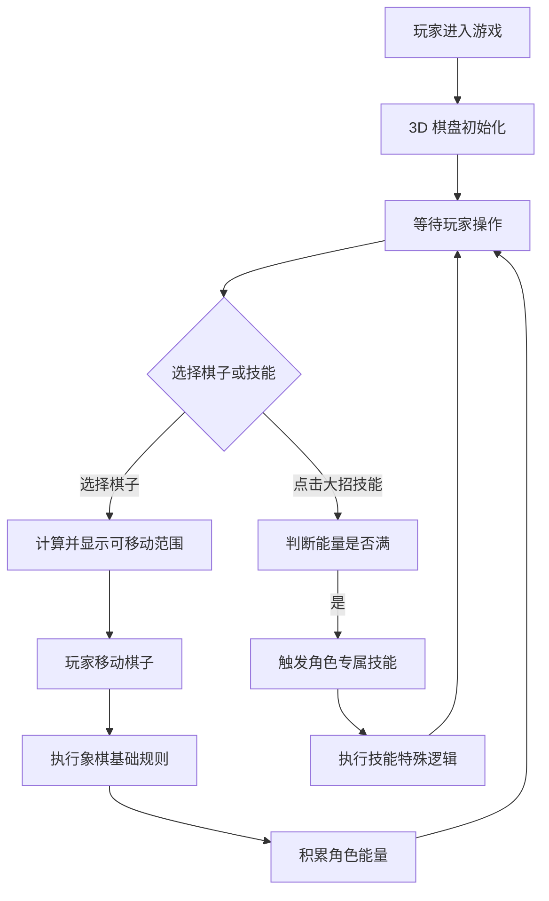

## 1. 产品概述
《象棋王》Web Demo 是一款结合传统中国象棋与二次元科幻设定的 3D 网页游戏。
- 主要目的：展示“全息投影 3D 棋盘”与“角色技能大招”相结合的核心游戏玩法。
- 目标用户：喜欢二次元风格、策略战棋游戏和象棋的玩家。
- 市场价值：探索传统棋类游戏在视觉与玩法创新上的可能性，验证核心玩法原型的可行性。

## 2. 核心功能

### 2.1 用户角色
| 角色 | 注册方式 | 核心权限 |
|------|----------|----------|
| 玩家 | 访客/无需注册 | 体验完整的单机对战与技能释放流程 |

### 2.2 功能模块
1. **对战主界面 (Battle UI)**：3D悬浮棋盘、棋子交互、底部二次元UI、技能释放与状态栏。

### 2.3 页面详情
| 页面名称 | 模块名称 | 功能描述 |
|----------|----------|----------|
| 对战主界面 | 3D棋盘模块 | 渲染悬浮的 3D 棋盘，展示带有科技光效的棋子模型，实现象棋基础走子规则（如马走日、象飞田等）。 |
| | 角色状态栏 | 位于屏幕底部，展示玩家角色立绘（如聂无悔）、血条与能量条（SP）。走子或吃子可积累能量。 |
| | 技能释放区 | 位于屏幕右下角，展示带有 CD 冷却读条的技能图标。能量满时按钮闪烁，点击可释放专属绝招（如“天地同寿”、“雷霆万钧”）。 |

## 3. 核心流程
玩家进入游戏 -> 观察棋局 -> 选择己方棋子 -> 显示可移动范围 -> 移动棋子 -> 积累能量 -> 能量满时点击技能 -> 触发技能特效并改变战局。

## 4. 用户界面设计
### 4.1 设计风格
- 主次色调：赛博朋克深蓝色、霓虹光效（红方使用热血橙红，黑方使用冷酷暗黑）。
- 按钮风格：全息投影感，带有发光边框和半透明背景。
- 字体与字号：科技感无衬线字体（如 Orbitron 风格的网页字体），关键数据采用粗体高亮。
- 布局风格：HUD (Head-Up Display) 风格的覆盖层布局，主视图为 3D 场景，UI 贴靠底部与边角。
- 图标风格：扁平化发光图标，带有环形进度条。

### 4.2 页面设计概览
| 页面名称 | 模块名称 | UI 元素 |
|----------|----------|---------|
| 对战主界面 | 3D场景 | 悬浮棋盘底座，带有网格光效；立体棋子（如使用圆柱体加上特殊材质贴图代表），移动时带有拖尾光效。 |
| | 底部状态栏 | 左侧展示动漫风格角色头像/立绘，旁边是长条形血条（HP）和能量条（SP）。 |
| | 技能控制区 | 右侧展示圆形技能图标，能量未满时呈灰色且显示百分比，满时呈现高亮呼吸闪烁效果。 |

### 4.3 响应式设计
以桌面端优先（Desktop-first），横屏全屏展示以获得最佳沉浸感。支持自适应缩放以兼容不同分辨率屏幕。

### 4.4 3D 场景指导
- 环境与氛围：深邃的赛博朋克暗空间，背景带有轻微的粒子漂浮物或网格线。
- 光照设置：环境光较暗，主要依靠棋盘自发光材质（Emissive）和点光源（PointLight）营造氛围。
- 相机设置：使用透视相机（PerspectiveCamera），默认视角为俯视 45 度角，玩家可微调旋转和缩放。
- 材质与特效：棋子使用金属质感材质结合发光材质；走子时使用简单的补间动画（Tween）并附带发光材质切换。
